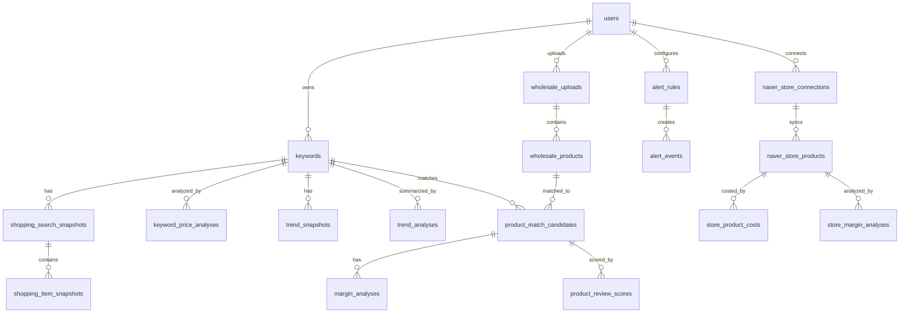

# 10. 셀러레이더 데이터베이스 상세 설계서

- 문서 버전: v0.1
- 기준일: 2026-07-03
- 대상 프로젝트: 셀러레이더(Seller Radar)
- DBMS: PostgreSQL
- 적용 범위: P0~P14 전체 로드맵 기준. 단, P1~P3은 즉시 구현 가능한 물리 설계 수준으로 정의한다.

---

## 1. 설계 목표

셀러레이더 DB는 단순 CRUD 저장소가 아니라, 외부 API 호출 한도와 추천 품질 리스크를 제어하기 위한 **스냅샷/캐시 중심 데이터 저장소**다.

핵심 목표는 다음과 같다.

```text
1. 외부 API 결과를 매번 실시간 호출하지 않고 snapshot/cache로 저장한다.
2. 같은 사용자/키워드/일자 기준 중복 호출을 방지한다.
3. 네이버 쇼핑 검색 결과, 트렌드 결과, 도매 상품 데이터를 분리 저장한다.
4. 추천점수와 마진 계산은 재계산 가능하도록 원천 데이터와 계산 결과를 분리한다.
5. 스마트스토어 API, 앱인토스, 디자인 대개편까지 확장 가능한 구조를 유지한다.
```

---

## 2. DB 설계 원칙

| 원칙 | 내용 |
|---|---|
| Snapshot First | 네이버/도매/스마트스토어 외부 데이터는 원본 응답을 즉시 화면에만 쓰지 않고 snapshot 테이블에 저장한다. |
| Cache Reuse | 같은 키워드는 같은 날짜에 재분석하지 않고 저장된 snapshot을 재사용한다. |
| URL Only Image | 상품 이미지는 다운로드하지 않고 `image_url`만 저장한다. |
| Rule Based Scoring | MVP에서는 AI 없이 룰 기반 점수와 마진 계산 결과를 저장한다. |
| Append-Friendly | 가격/트렌드/정산 데이터는 시간이 지남에 따라 append되는 구조를 우선한다. |
| Soft Delete | 사용자 데이터는 가능하면 `active=false` 또는 `deleted_at`으로 비활성 처리한다. |
| No Secret in DB Plain Text | API secret/token은 평문 저장하지 않는다. MVP에서는 환경변수 우선, 연동 이후 암호화 컬럼을 둔다. |
| UI Decoupling | 디자인 대개편을 대비해 화면 상태보다 도메인 데이터를 우선한다. |

---

## 3. Phase별 DB 적용 범위

| Phase | 명칭 | 주요 테이블 |
|---:|---|---|
| P0 | 기반 구축 | PostgreSQL, migration 기반, 공통 DB 운영 원칙 |
| P1 | 키워드 레이더 | `users`, `keywords` |
| P2 | 네이버 쇼핑 스냅샷 | `shopping_search_snapshots`, `shopping_item_snapshots`, `api_call_logs` |
| P3 | 가격/경쟁 분석 | `keyword_price_analyses` |
| P4 | 데이터랩 트렌드 분석 | `trend_snapshots`, `trend_analyses` |
| P5 | 도매 CSV/XLSX 업로드 | `wholesale_uploads`, `wholesale_products`, `wholesale_column_mappings` |
| P6 | 마진/상품 검토 점수 | `product_match_candidates`, `margin_analyses`, `product_review_scores`, `risk_category_rules` |
| P7 | 알림/배치 | `alert_rules`, `alert_events`, `batch_job_histories` |
| P8 | Web SaaS 하드닝 | `user_settings`, `subscription_plans`, `user_subscriptions`, `audit_logs` |
| P9 | 스마트스토어 API 1차 연동 | `naver_store_connections`, `naver_store_products` |
| P10 | 스마트스토어 내 상품 마진 감시 | `store_product_costs`, `store_margin_analyses` |
| P11 | 주문/정산/수수료 연동 | `naver_order_snapshots`, `naver_settlement_snapshots`, `naver_commission_snapshots` |
| P12 | 디자인 대개편 | 신규 핵심 테이블 없음. 필요 시 `user_ui_preferences`만 선택. |
| P13 | 앱인토스 Lite | `toss_app_users`, `toss_payment_events`, `toss_subscription_links` |
| P14 | 베타/수익화 | `usage_metrics_daily`, `feature_usage_events` |

---

## 4. 전체 ERD 개요



---

## 5. 공통 컬럼 규칙

| 컬럼 | 타입 | 규칙 |
|---|---|---|
| `id` | `BIGINT` | `GENERATED BY DEFAULT AS IDENTITY` 권장 |
| `created_at` | `TIMESTAMPTZ` | 기본값 `now()` |
| `updated_at` | `TIMESTAMPTZ` | 애플리케이션 또는 trigger에서 갱신 |
| `deleted_at` | `TIMESTAMPTZ` | Soft delete가 필요한 테이블에만 사용 |
| `active` | `BOOLEAN` | 기본값 `true` |
| `raw_payload` | `JSONB` | 외부 API 원본 응답 일부 또는 파일 row 원본 보관 |

MVP에서는 trigger 없이 애플리케이션에서 `updated_at`을 갱신한다. 운영 안정화 단계에서 `updated_at` trigger를 도입해도 된다.

---

## 6. 상태값/Enum 정의

PostgreSQL native enum은 변경이 번거로우므로 MVP에서는 `VARCHAR(30)` + CHECK 제약 또는 애플리케이션 enum을 우선한다.

| 상태명 | 값 |
|---|---|
| `analysis_status` | `PENDING`, `RUNNING`, `SUCCESS`, `FAILED`, `SKIPPED` |
| `competition_level` | `UNKNOWN`, `LOW`, `MEDIUM`, `HIGH`, `VERY_HIGH` |
| `candidate_grade` | `EXCLUDED`, `HOLD`, `REVIEW`, `RECOMMENDED` |
| `margin_status` | `UNKNOWN`, `LOSS`, `DANGER`, `CAUTION`, `SAFE` |
| `alert_type` | `REVIEW_SCORE`, `MARGIN_DROP`, `TREND_RISE`, `PRICE_DROP`, `BATCH_FAILED` |
| `alert_status` | `UNREAD`, `READ`, `ARCHIVED` |
| `upload_status` | `UPLOADED`, `MAPPING_REQUIRED`, `PROCESSING`, `COMPLETED`, `FAILED` |
| `connection_status` | `CONNECTED`, `EXPIRED`, `DISCONNECTED`, `ERROR` |
| `plan_code` | `FREE`, `BASIC`, `PRO`, `BETA` |

---

# 7. P1~P3 즉시 구현 대상 상세 설계

## 7.1 `users`

초기에는 인증을 단순화하더라도 `users` 테이블은 둔다. 인증 미구현 시 seed user 또는 `X-USER-ID` 헤더로 임시 사용한다.

| 컬럼 | 타입 | Nullable | 기본값 | 설명 |
|---|---|---:|---|---|
| `id` | `BIGINT` | N | identity | 내부 사용자 ID |
| `public_id` | `UUID` | N | app generated | 외부 노출용 ID. 앱에서 생성 권장 |
| `email` | `VARCHAR(255)` | Y |  | 로그인 도입 전 nullable 허용 |
| `display_name` | `VARCHAR(100)` | Y |  | 사용자 표시명 |
| `plan_code` | `VARCHAR(30)` | N | `FREE` | 요금제 코드 |
| `active` | `BOOLEAN` | N | `true` | 활성 여부 |
| `created_at` | `TIMESTAMPTZ` | N | `now()` | 생성일 |
| `updated_at` | `TIMESTAMPTZ` | N | `now()` | 수정일 |
| `deleted_at` | `TIMESTAMPTZ` | Y |  | 탈퇴/삭제 처리 |

### 제약/인덱스

```sql
ALTER TABLE users ADD CONSTRAINT uk_users_public_id UNIQUE (public_id);
CREATE UNIQUE INDEX uk_users_email_active ON users(email) WHERE email IS NOT NULL AND deleted_at IS NULL;
CREATE INDEX idx_users_plan_code ON users(plan_code);
```

---

## 7.2 `keywords`

사용자가 분석할 키워드를 저장한다. 같은 사용자에게 같은 정규화 키워드는 중복 등록할 수 없다.

| 컬럼 | 타입 | Nullable | 기본값 | 설명 |
|---|---|---:|---|---|
| `id` | `BIGINT` | N | identity | 키워드 ID |
| `user_id` | `BIGINT` | N |  | `users.id` FK |
| `keyword` | `VARCHAR(200)` | N |  | 사용자가 입력한 원본 키워드 |
| `normalized_keyword` | `VARCHAR(200)` | N |  | 공백 정리, 소문자화 등 정규화 값 |
| `category` | `VARCHAR(100)` | Y |  | 사용자 지정 또는 관리자 카테고리 |
| `active` | `BOOLEAN` | N | `true` | 분석 대상 여부 |
| `analysis_status` | `VARCHAR(30)` | N | `PENDING` | 최근 분석 상태 |
| `last_analyzed_at` | `TIMESTAMPTZ` | Y |  | 마지막 분석 완료 시각 |
| `last_snapshot_date` | `DATE` | Y |  | 마지막 쇼핑 스냅샷 일자 |
| `created_at` | `TIMESTAMPTZ` | N | `now()` | 생성일 |
| `updated_at` | `TIMESTAMPTZ` | N | `now()` | 수정일 |
| `deleted_at` | `TIMESTAMPTZ` | Y |  | 삭제 처리 |

### 제약/인덱스

```sql
ALTER TABLE keywords
  ADD CONSTRAINT fk_keywords_user FOREIGN KEY (user_id) REFERENCES users(id);

CREATE UNIQUE INDEX uk_keywords_user_normalized_active
  ON keywords(user_id, normalized_keyword)
  WHERE deleted_at IS NULL;

CREATE INDEX idx_keywords_user_active ON keywords(user_id, active);
CREATE INDEX idx_keywords_last_analyzed_at ON keywords(last_analyzed_at);
CREATE INDEX idx_keywords_category ON keywords(category);
```

### 정규화 규칙

```text
1. 앞뒤 공백 제거
2. 중복 공백 1개로 축소
3. 영문은 lower-case
4. 특수문자 제거는 하지 않는다. 상품명 키워드에서 의미가 있을 수 있음.
```

---

## 7.3 `shopping_search_snapshots`

키워드 단위 네이버 쇼핑 검색 결과 요약을 저장한다. 같은 키워드/검색일자/정렬조건은 1개 snapshot만 저장한다.

| 컬럼 | 타입 | Nullable | 기본값 | 설명 |
|---|---|---:|---|---|
| `id` | `BIGINT` | N | identity | 스냅샷 ID |
| `keyword_id` | `BIGINT` | N |  | `keywords.id` FK |
| `search_date` | `DATE` | N | current date | 분석 기준일 |
| `query` | `VARCHAR(200)` | N |  | 실제 API 호출 검색어 |
| `sort_type` | `VARCHAR(20)` | N | `sim` | `sim`, `date`, `asc`, `dsc` 등 |
| `display_count` | `INT` | N | 100 | 요청 표시 개수 |
| `total_count` | `INT` | Y |  | API 응답 total |
| `min_price` | `NUMERIC(14,2)` | Y |  | item 최저가 기준 최소값 |
| `max_price` | `NUMERIC(14,2)` | Y |  | item 최저가 기준 최대값 |
| `avg_price` | `NUMERIC(14,2)` | Y |  | item 최저가 기준 평균값 |
| `median_price` | `NUMERIC(14,2)` | Y |  | 중간값. MVP에서는 nullable 가능 |
| `price_spread_rate` | `NUMERIC(8,4)` | Y |  | `(max-min)/avg` |
| `competition_level` | `VARCHAR(30)` | N | `UNKNOWN` | 경쟁강도 |
| `api_cache_hit` | `BOOLEAN` | N | `false` | 캐시 재사용 여부 |
| `status` | `VARCHAR(30)` | N | `SUCCESS` | 수집 상태 |
| `error_message` | `TEXT` | Y |  | 실패 사유 |
| `raw_summary` | `JSONB` | Y |  | 원본 응답 요약 |
| `fetched_at` | `TIMESTAMPTZ` | N | `now()` | 외부 API 수집 시각 |
| `created_at` | `TIMESTAMPTZ` | N | `now()` | 생성일 |

### 제약/인덱스

```sql
ALTER TABLE shopping_search_snapshots
  ADD CONSTRAINT fk_shopping_snapshots_keyword FOREIGN KEY (keyword_id) REFERENCES keywords(id);

CREATE UNIQUE INDEX uk_shopping_snapshot_keyword_date_sort
  ON shopping_search_snapshots(keyword_id, search_date, sort_type);

CREATE INDEX idx_shopping_snapshots_search_date ON shopping_search_snapshots(search_date);
CREATE INDEX idx_shopping_snapshots_competition ON shopping_search_snapshots(competition_level);
```

### 경쟁강도 MVP 룰

```text
UNKNOWN: total_count가 없거나 item이 0개
LOW: total_count < 3,000
MEDIUM: 3,000 <= total_count < 10,000
HIGH: total_count >= 10,000
VERY_HIGH: DB compatibility reserved value. Not emitted by the P3-001 MVP calculator.
```

위 기준은 임시 룰이며 P3에서 가격대와 리뷰/몰 집중도 등의 지표를 추가해 개선한다.

---

## 7.4 `shopping_item_snapshots`

네이버 쇼핑 검색 API의 item 단위 데이터를 저장한다. 상품 이미지는 파일로 저장하지 않고 `image_url`만 저장한다.

| 컬럼 | 타입 | Nullable | 기본값 | 설명 |
|---|---|---:|---|---|
| `id` | `BIGINT` | N | identity | item snapshot ID |
| `snapshot_id` | `BIGINT` | N |  | `shopping_search_snapshots.id` FK |
| `keyword_id` | `BIGINT` | N |  | 조회 편의를 위한 중복 FK |
| `source` | `VARCHAR(30)` | N | `NAVER_SHOPPING` | 데이터 출처 |
| `source_product_id` | `VARCHAR(100)` | Y |  | 네이버 `productId` |
| `rank_no` | `INT` | N |  | 검색 결과 순위 |
| `title_raw` | `TEXT` | N |  | API 원본 title. HTML 태그 포함 가능 |
| `title_clean` | `TEXT` | Y |  | HTML 제거/정리한 title |
| `product_url` | `TEXT` | N |  | 원본 상품 링크 |
| `image_url` | `TEXT` | Y |  | 썸네일 URL |
| `low_price` | `NUMERIC(14,2)` | Y |  | `lprice` |
| `high_price` | `NUMERIC(14,2)` | Y |  | `hprice` |
| `mall_name` | `VARCHAR(200)` | Y |  | 판매처/몰명 |
| `brand` | `VARCHAR(200)` | Y |  | 브랜드 |
| `maker` | `VARCHAR(200)` | Y |  | 제조사 |
| `category1` | `VARCHAR(100)` | Y |  | 대분류 |
| `category2` | `VARCHAR(100)` | Y |  | 중분류 |
| `category3` | `VARCHAR(100)` | Y |  | 소분류 |
| `category4` | `VARCHAR(100)` | Y |  | 세분류 |
| `raw_item` | `JSONB` | Y |  | API item 원본 |
| `fetched_at` | `TIMESTAMPTZ` | N | `now()` | 수집 시각 |
| `created_at` | `TIMESTAMPTZ` | N | `now()` | 생성일 |

### 제약/인덱스

```sql
ALTER TABLE shopping_item_snapshots
  ADD CONSTRAINT fk_shopping_items_snapshot FOREIGN KEY (snapshot_id) REFERENCES shopping_search_snapshots(id);
ALTER TABLE shopping_item_snapshots
  ADD CONSTRAINT fk_shopping_items_keyword FOREIGN KEY (keyword_id) REFERENCES keywords(id);

CREATE UNIQUE INDEX uk_shopping_item_snapshot_rank
  ON shopping_item_snapshots(snapshot_id, rank_no);

CREATE INDEX idx_shopping_items_keyword_price ON shopping_item_snapshots(keyword_id, low_price);
CREATE INDEX idx_shopping_items_source_product ON shopping_item_snapshots(source, source_product_id);
CREATE INDEX idx_shopping_items_category ON shopping_item_snapshots(category1, category2);
```

---

## 7.5 `api_call_logs`

외부 API 호출 이력을 저장한다. 호출 한도, 실패 원인, 429 대응에 필요하다.

| 컬럼 | 타입 | Nullable | 기본값 | 설명 |
|---|---|---:|---|---|
| `id` | `BIGINT` | N | identity | 로그 ID |
| `provider` | `VARCHAR(50)` | N |  | `NAVER_SEARCH`, `NAVER_DATALAB`, `NAVER_COMMERCE` 등 |
| `endpoint` | `VARCHAR(200)` | N |  | 호출 endpoint 또는 기능명 |
| `request_key` | `VARCHAR(500)` | Y |  | 중복/캐시 판단용 키 |
| `http_status` | `INT` | Y |  | HTTP status |
| `success` | `BOOLEAN` | N | `false` | 성공 여부 |
| `duration_ms` | `INT` | Y |  | 응답시간 |
| `error_code` | `VARCHAR(100)` | Y |  | 외부 API 오류 코드 |
| `error_message` | `TEXT` | Y |  | 오류 메시지 |
| `rate_limit_scope` | `VARCHAR(100)` | Y |  | 일별/앱별 등 한도 범위 |
| `called_at` | `TIMESTAMPTZ` | N | `now()` | 호출 시각 |

### 인덱스

```sql
CREATE INDEX idx_api_call_logs_provider_called_at ON api_call_logs(provider, called_at DESC);
CREATE INDEX idx_api_call_logs_success_called_at ON api_call_logs(success, called_at DESC);
CREATE INDEX idx_api_call_logs_request_key ON api_call_logs(request_key);
```

---

## 7.6 `batch_job_histories`

배치 실행 이력을 저장한다.

| 컬럼 | 타입 | Nullable | 기본값 | 설명 |
|---|---|---:|---|---|
| `id` | `BIGINT` | N | identity | 배치 이력 ID |
| `job_name` | `VARCHAR(100)` | N |  | 배치명 |
| `job_key` | `VARCHAR(300)` | Y |  | 특정 키워드/일자 등 실행 키 |
| `status` | `VARCHAR(30)` | N | `RUNNING` | `RUNNING`, `SUCCESS`, `FAILED`, `SKIPPED` |
| `started_at` | `TIMESTAMPTZ` | N | `now()` | 시작 시각 |
| `finished_at` | `TIMESTAMPTZ` | Y |  | 종료 시각 |
| `processed_count` | `INT` | N | 0 | 처리 건수 |
| `success_count` | `INT` | N | 0 | 성공 건수 |
| `fail_count` | `INT` | N | 0 | 실패 건수 |
| `message` | `TEXT` | Y |  | 요약 메시지 |
| `error_detail` | `TEXT` | Y |  | 실패 상세 |
| `created_at` | `TIMESTAMPTZ` | N | `now()` | 생성일 |

### 인덱스

```sql
CREATE INDEX idx_batch_job_histories_name_started ON batch_job_histories(job_name, started_at DESC);
CREATE INDEX idx_batch_job_histories_status ON batch_job_histories(status);
```

---

# 8. P4~P8 확장 테이블 설계

## 8.1 `keyword_price_analyses`

P3에서 쇼핑 스냅샷을 기반으로 가격/경쟁 분석 결과를 저장한다.

| 컬럼 | 타입 | 설명 |
|---|---|---|
| `id` | `BIGINT` | PK |
| `keyword_id` | `BIGINT` | FK |
| `snapshot_id` | `BIGINT` | FK |
| `analysis_date` | `DATE` | 분석 기준일 |
| `min_price` | `NUMERIC(14,2)` | 최저가 |
| `avg_price` | `NUMERIC(14,2)` | 평균가 |
| `median_price` | `NUMERIC(14,2)` | 중간가 |
| `price_spread_rate` | `NUMERIC(8,4)` | 가격 편차율 |
| `result_count` | `INT` | 검색 결과 수 |
| `competition_score` | `NUMERIC(5,2)` | 경쟁 점수 |
| `competition_level` | `VARCHAR(30)` | 경쟁강도 |
| `analysis_reason` | `JSONB` | 계산 근거 |
| `created_at` | `TIMESTAMPTZ` | 생성일 |

Unique: `(keyword_id, analysis_date)`.

---

## 8.2 `trend_snapshots`

네이버 데이터랩 쇼핑인사이트의 시계열 ratio 값을 저장한다.

| 컬럼 | 타입 | 설명 |
|---|---|---|
| `id` | `BIGINT` | PK |
| `keyword_id` | `BIGINT` | FK |
| `snapshot_date` | `DATE` | 수집일 |
| `period_start` | `DATE` | 조회 시작일 |
| `period_end` | `DATE` | 조회 종료일 |
| `time_unit` | `VARCHAR(20)` | `date`, `week`, `month` |
| `data_period` | `DATE` | 데이터 포인트 기준일 |
| `ratio` | `NUMERIC(10,4)` | 검색 클릭 추이 ratio |
| `device` | `VARCHAR(20)` | 전체/PC/MO 등 |
| `gender` | `VARCHAR(20)` | 전체/남/여 등 |
| `ages` | `VARCHAR(100)` | 연령 필터 |
| `raw_payload` | `JSONB` | 원본 데이터 |
| `created_at` | `TIMESTAMPTZ` | 생성일 |

Unique: `(keyword_id, snapshot_date, time_unit, data_period, coalesce(device,''), coalesce(gender,''), coalesce(ages,''))`.

---

## 8.3 `trend_analyses`

트렌드 스냅샷을 요약해 상승률/점수를 저장한다.

| 컬럼 | 타입 | 설명 |
|---|---|---|
| `id` | `BIGINT` | PK |
| `keyword_id` | `BIGINT` | FK |
| `analysis_date` | `DATE` | 분석일 |
| `recent_7d_avg` | `NUMERIC(10,4)` | 최근 7일 평균 |
| `previous_7d_avg` | `NUMERIC(10,4)` | 이전 7일 평균 |
| `recent_30d_avg` | `NUMERIC(10,4)` | 최근 30일 평균 |
| `growth_7d_rate` | `NUMERIC(10,4)` | 7일 성장률 |
| `growth_30d_rate` | `NUMERIC(10,4)` | 30일 성장률 |
| `trend_score` | `NUMERIC(5,2)` | 트렌드 점수 |
| `trend_level` | `VARCHAR(30)` | `DOWN`, `FLAT`, `UP`, `SPIKE` |
| `analysis_reason` | `JSONB` | 계산 근거 |
| `created_at` | `TIMESTAMPTZ` | 생성일 |

Unique: `(keyword_id, analysis_date)`.

---

## 8.4 `wholesale_uploads`

도매 CSV/XLSX 업로드 파일 단위 이력이다.

| 컬럼 | 타입 | 설명 |
|---|---|---|
| `id` | `BIGINT` | PK |
| `user_id` | `BIGINT` | FK |
| `source_name` | `VARCHAR(100)` | 도매매, 오너클랜, CUSTOM 등 |
| `original_file_name` | `VARCHAR(255)` | 원본 파일명 |
| `file_type` | `VARCHAR(20)` | CSV, XLSX, XLS |
| `status` | `VARCHAR(30)` | 업로드 상태 |
| `total_rows` | `INT` | 전체 row 수 |
| `success_rows` | `INT` | 성공 row 수 |
| `failed_rows` | `INT` | 실패 row 수 |
| `error_summary` | `TEXT` | 오류 요약 |
| `column_mapping` | `JSONB` | 컬럼 매핑 정보 |
| `created_at` | `TIMESTAMPTZ` | 업로드일 |

---

## 8.5 `wholesale_products`

업로드된 도매 상품 후보 데이터다.

| 컬럼 | 타입 | 설명 |
|---|---|---|
| `id` | `BIGINT` | PK |
| `upload_id` | `BIGINT` | FK |
| `user_id` | `BIGINT` | FK |
| `source_name` | `VARCHAR(100)` | 공급처 |
| `external_product_id` | `VARCHAR(200)` | 공급처 상품 ID |
| `product_name` | `TEXT` | 상품명 |
| `normalized_product_name` | `TEXT` | 정규화 상품명 |
| `supply_price` | `NUMERIC(14,2)` | 공급가 |
| `shipping_fee` | `NUMERIC(14,2)` | 배송비 |
| `image_url` | `TEXT` | 이미지 URL |
| `product_url` | `TEXT` | 원본 상품 URL |
| `category` | `VARCHAR(200)` | 공급처 카테고리 |
| `brand` | `VARCHAR(200)` | 브랜드 |
| `maker` | `VARCHAR(200)` | 제조사 |
| `option_name` | `VARCHAR(300)` | 옵션명 |
| `stock_status` | `VARCHAR(100)` | 재고상태 |
| `is_sold_out` | `BOOLEAN` | 품절 여부 |
| `memo` | `TEXT` | 메모 |
| `raw_row` | `JSONB` | 원본 row |
| `created_at` | `TIMESTAMPTZ` | 생성일 |

인덱스: `(user_id, source_name)`, `normalized_product_name gin/trgm 선택`, `(supply_price)`.

---

## 8.6 `product_match_candidates`

도매 상품과 키워드/쇼핑 상품 후보의 매칭 결과다.

| 컬럼 | 타입 | 설명 |
|---|---|---|
| `id` | `BIGINT` | PK |
| `user_id` | `BIGINT` | FK |
| `keyword_id` | `BIGINT` | FK |
| `wholesale_product_id` | `BIGINT` | FK |
| `shopping_snapshot_id` | `BIGINT` | FK nullable |
| `matched_keyword` | `VARCHAR(200)` | 매칭 키워드 |
| `match_score` | `NUMERIC(5,2)` | 0~100 유사도 |
| `match_method` | `VARCHAR(50)` | `KEYWORD`, `TRIGRAM`, `MANUAL` |
| `status` | `VARCHAR(30)` | `PENDING`, `MATCHED`, `REJECTED`, `CONFIRMED` |
| `created_at` | `TIMESTAMPTZ` | 생성일 |

Unique: `(keyword_id, wholesale_product_id)`.

---

## 8.7 `margin_analyses`

후보 상품별 예상 마진 계산 결과다.

| 컬럼 | 타입 | 설명 |
|---|---|---|
| `id` | `BIGINT` | PK |
| `candidate_id` | `BIGINT` | FK |
| `analysis_date` | `DATE` | 기준일 |
| `expected_sale_price` | `NUMERIC(14,2)` | 예상 판매가 |
| `supply_price` | `NUMERIC(14,2)` | 공급가 |
| `shipping_fee` | `NUMERIC(14,2)` | 배송비 |
| `platform_fee_rate` | `NUMERIC(6,4)` | 플랫폼 수수료율 |
| `platform_fee_amount` | `NUMERIC(14,2)` | 플랫폼 수수료액 |
| `packaging_fee` | `NUMERIC(14,2)` | 포장비 |
| `ad_cost` | `NUMERIC(14,2)` | 예상 광고비 |
| `coupon_cost` | `NUMERIC(14,2)` | 예상 쿠폰비 |
| `total_cost` | `NUMERIC(14,2)` | 총비용 |
| `expected_profit` | `NUMERIC(14,2)` | 예상 이익 |
| `expected_margin_rate` | `NUMERIC(8,4)` | 예상 마진율 |
| `target_margin_rate` | `NUMERIC(8,4)` | 목표 마진율 |
| `margin_status` | `VARCHAR(30)` | 상태 |
| `calculation_detail` | `JSONB` | 계산 근거 |
| `created_at` | `TIMESTAMPTZ` | 생성일 |

Unique: `(candidate_id, analysis_date)`.

---

## 8.8 `product_review_scores`

상품 검토 점수 결과다. “판매 성공 점수”라는 표현은 사용하지 않는다.

| 컬럼 | 타입 | 설명 |
|---|---|---|
| `id` | `BIGINT` | PK |
| `candidate_id` | `BIGINT` | FK |
| `analysis_date` | `DATE` | 기준일 |
| `trend_score` | `NUMERIC(5,2)` | 트렌드 점수 |
| `price_score` | `NUMERIC(5,2)` | 가격대 점수 |
| `margin_score` | `NUMERIC(5,2)` | 마진 점수 |
| `competition_score` | `NUMERIC(5,2)` | 경쟁 점수 |
| `risk_penalty` | `NUMERIC(5,2)` | 위험 감점 |
| `total_score` | `NUMERIC(5,2)` | 최종 검토 점수 |
| `grade` | `VARCHAR(30)` | `EXCLUDED`, `HOLD`, `REVIEW`, `RECOMMENDED` |
| `score_reason` | `JSONB` | 점수 근거 |
| `created_at` | `TIMESTAMPTZ` | 생성일 |

Unique: `(candidate_id, analysis_date)`.

---

## 8.9 `risk_category_rules`

위험 카테고리 룰이다. 식품, 화장품, 의료기기, 전기/배터리, 어린이제품 등은 초기 추천에서 제외하거나 강한 감점을 준다.

| 컬럼 | 타입 | 설명 |
|---|---|---|
| `id` | `BIGINT` | PK |
| `category_keyword` | `VARCHAR(200)` | 위험 카테고리 키워드 |
| `risk_level` | `VARCHAR(30)` | `LOW`, `MEDIUM`, `HIGH`, `BLOCKED` |
| `is_recommendable` | `BOOLEAN` | 추천 가능 여부 |
| `penalty_score` | `NUMERIC(5,2)` | 감점 |
| `reason` | `TEXT` | 사유 |
| `active` | `BOOLEAN` | 활성 여부 |
| `created_at` | `TIMESTAMPTZ` | 생성일 |

---

## 8.10 `alert_rules` / `alert_events`

알림 조건과 발생 이벤트를 분리한다.

### `alert_rules`

| 컬럼 | 타입 | 설명 |
|---|---|---|
| `id` | `BIGINT` | PK |
| `user_id` | `BIGINT` | FK |
| `rule_name` | `VARCHAR(100)` | 규칙명 |
| `alert_type` | `VARCHAR(30)` | 알림 유형 |
| `threshold_value` | `NUMERIC(10,4)` | 기준값 |
| `condition_json` | `JSONB` | 상세 조건 |
| `active` | `BOOLEAN` | 활성 여부 |
| `created_at` | `TIMESTAMPTZ` | 생성일 |

### `alert_events`

| 컬럼 | 타입 | 설명 |
|---|---|---|
| `id` | `BIGINT` | PK |
| `user_id` | `BIGINT` | FK |
| `alert_rule_id` | `BIGINT` | FK nullable |
| `alert_type` | `VARCHAR(30)` | 알림 유형 |
| `title` | `VARCHAR(200)` | 제목 |
| `message` | `TEXT` | 본문 |
| `target_type` | `VARCHAR(50)` | `KEYWORD`, `CANDIDATE`, `STORE_PRODUCT` 등 |
| `target_id` | `BIGINT` | 대상 ID |
| `status` | `VARCHAR(30)` | `UNREAD`, `READ`, `ARCHIVED` |
| `created_at` | `TIMESTAMPTZ` | 생성일 |
| `read_at` | `TIMESTAMPTZ` | 읽은 시각 |

---

# 9. P9~P11 스마트스토어 연동 테이블 설계

스마트스토어 API 연동은 앱인토스보다 먼저 진행한다. 단, P9에서는 상품 목록/판매가 동기화만 우선한다.

## 9.1 `naver_store_connections`

| 컬럼 | 타입 | 설명 |
|---|---|---|
| `id` | `BIGINT` | PK |
| `user_id` | `BIGINT` | FK |
| `store_name` | `VARCHAR(200)` | 스토어명 |
| `store_id` | `VARCHAR(100)` | 외부 스토어 식별자 |
| `seller_id` | `VARCHAR(100)` | 판매자 식별자 |
| `connection_status` | `VARCHAR(30)` | 연결 상태 |
| `access_token_encrypted` | `TEXT` | 암호화 access token. MVP에서는 보류 가능 |
| `refresh_token_encrypted` | `TEXT` | 암호화 refresh token. API 구조에 맞춰 조정 |
| `token_expires_at` | `TIMESTAMPTZ` | 토큰 만료 시각 |
| `last_synced_at` | `TIMESTAMPTZ` | 마지막 동기화 |
| `created_at` | `TIMESTAMPTZ` | 생성일 |
| `updated_at` | `TIMESTAMPTZ` | 수정일 |

토큰 저장은 보안 검토 후 구현한다. 초기 검증에서는 개인 개발자 계정 단일 연동 또는 환경변수 기반으로 제한할 수 있다.

---

## 9.2 `naver_store_products`

| 컬럼 | 타입 | 설명 |
|---|---|---|
| `id` | `BIGINT` | PK |
| `connection_id` | `BIGINT` | FK |
| `user_id` | `BIGINT` | FK |
| `channel_product_no` | `VARCHAR(100)` | 채널 상품 번호 |
| `origin_product_no` | `VARCHAR(100)` | 원상품 번호 |
| `product_name` | `TEXT` | 상품명 |
| `sale_price` | `NUMERIC(14,2)` | 현재 판매가 |
| `sale_status` | `VARCHAR(50)` | 판매상태 |
| `image_url` | `TEXT` | 대표 이미지 URL |
| `category_name` | `VARCHAR(300)` | 카테고리 |
| `raw_payload` | `JSONB` | 원본 응답 |
| `last_synced_at` | `TIMESTAMPTZ` | 마지막 동기화 |
| `created_at` | `TIMESTAMPTZ` | 생성일 |
| `updated_at` | `TIMESTAMPTZ` | 수정일 |

Unique: `(connection_id, channel_product_no)`.

---

## 9.3 `store_product_costs`

스마트스토어는 매입가를 알 수 없으므로 사용자가 직접 입력하거나 도매 상품과 매칭해야 한다.

| 컬럼 | 타입 | 설명 |
|---|---|---|
| `id` | `BIGINT` | PK |
| `store_product_id` | `BIGINT` | FK |
| `user_id` | `BIGINT` | FK |
| `wholesale_product_id` | `BIGINT` | FK nullable |
| `purchase_cost` | `NUMERIC(14,2)` | 매입가 |
| `shipping_fee` | `NUMERIC(14,2)` | 배송비 |
| `packaging_fee` | `NUMERIC(14,2)` | 포장비 |
| `target_margin_rate` | `NUMERIC(8,4)` | 목표 마진율 |
| `memo` | `TEXT` | 메모 |
| `created_at` | `TIMESTAMPTZ` | 생성일 |
| `updated_at` | `TIMESTAMPTZ` | 수정일 |

---

## 9.4 `store_margin_analyses`

내 스마트스토어 상품의 예상/실제 마진 감시 결과다.

| 컬럼 | 타입 | 설명 |
|---|---|---|
| `id` | `BIGINT` | PK |
| `store_product_id` | `BIGINT` | FK |
| `analysis_date` | `DATE` | 기준일 |
| `sale_price` | `NUMERIC(14,2)` | 판매가 |
| `purchase_cost` | `NUMERIC(14,2)` | 매입가 |
| `estimated_fee` | `NUMERIC(14,2)` | 예상 수수료 |
| `estimated_profit` | `NUMERIC(14,2)` | 예상 순이익 |
| `estimated_margin_rate` | `NUMERIC(8,4)` | 예상 마진율 |
| `actual_settlement_amount` | `NUMERIC(14,2)` | 실제 정산액 nullable |
| `actual_fee_amount` | `NUMERIC(14,2)` | 실제 수수료 nullable |
| `margin_status` | `VARCHAR(30)` | 상태 |
| `analysis_reason` | `JSONB` | 계산 근거 |
| `created_at` | `TIMESTAMPTZ` | 생성일 |

Unique: `(store_product_id, analysis_date)`.

---

## 9.5 `naver_order_snapshots`, `naver_settlement_snapshots`, `naver_commission_snapshots`

P11에서 도입한다. 원본 응답의 구조 변경 가능성이 크므로 핵심 컬럼 + `raw_payload JSONB`를 함께 저장한다.

### 공통 권장 컬럼

| 테이블 | 핵심 컬럼 |
|---|---|
| `naver_order_snapshots` | `connection_id`, `user_id`, `order_no`, `product_order_no`, `order_date`, `payment_amount`, `quantity`, `order_status`, `raw_payload` |
| `naver_settlement_snapshots` | `connection_id`, `user_id`, `settlement_date`, `product_order_no`, `settlement_amount`, `raw_payload` |
| `naver_commission_snapshots` | `connection_id`, `user_id`, `base_date`, `product_order_no`, `commission_type`, `commission_amount`, `raw_payload` |

---

# 10. P13 앱인토스 및 수익화 테이블 초안

앱인토스는 디자인 대개편 이후 진행한다. 핵심 분석 데이터는 기존 테이블을 재사용하고, 토스 진입 사용자/결제 이벤트만 별도 저장한다.

## 10.1 `toss_app_users`

| 컬럼 | 타입 | 설명 |
|---|---|---|
| `id` | `BIGINT` | PK |
| `user_id` | `BIGINT` | FK nullable. 웹 계정과 연결 전에는 nullable |
| `toss_user_key` | `VARCHAR(200)` | 토스 사용자 식별 키 |
| `linked_at` | `TIMESTAMPTZ` | 웹 계정 연결 시각 |
| `created_at` | `TIMESTAMPTZ` | 생성일 |

## 10.2 `toss_payment_events`

| 컬럼 | 타입 | 설명 |
|---|---|---|
| `id` | `BIGINT` | PK |
| `user_id` | `BIGINT` | FK nullable |
| `toss_user_id` | `BIGINT` | FK nullable |
| `event_type` | `VARCHAR(50)` | 결제/구독 이벤트 유형 |
| `payment_key` | `VARCHAR(200)` | 결제 키 |
| `amount` | `NUMERIC(14,2)` | 결제 금액 |
| `status` | `VARCHAR(30)` | 상태 |
| `raw_payload` | `JSONB` | 원본 이벤트 |
| `created_at` | `TIMESTAMPTZ` | 생성일 |

---

# 11. Snapshot/Cache 정책

## 11.1 네이버 쇼핑 검색 캐시

| 항목 | 정책 |
|---|---|
| 캐시 키 | `keyword_id + search_date + sort_type` |
| 기본 TTL | 1일 |
| 재분석 | 같은 날짜에는 기본적으로 기존 snapshot 재사용 |
| 강제 재분석 | 관리자 또는 유료 기능에서 제한적으로 허용 가능 |
| 이미지 | `image_url`만 저장 |

## 11.2 데이터랩 트렌드 캐시

| 항목 | 정책 |
|---|---|
| 캐시 키 | `keyword_id + snapshot_date + time_unit + filter` |
| 기본 수집 | 일 1회 배치 |
| 사용자 등록 키워드 | 다음 배치부터 반영 |
| 무료 사용자 | 키워드 3개 제한 권장 |
| 유료 사용자 | 키워드 30개 이상 제한 권장 |

## 11.3 도매 CSV 데이터

| 항목 | 정책 |
|---|---|
| 보관 기준 | 사용자별 업로드 단위 |
| 원본 파일 | MVP에서는 파일 자체 저장 선택. 저장 시 접근권한 필요 |
| 원본 row | `raw_row JSONB`로 보관 |
| 이미지 | URL만 저장 |
| 매핑 | `column_mapping JSONB` 보관 |

## 11.4 보관 기간 권장

| 데이터 | 보관 기간 권장 |
|---|---|
| `api_call_logs` | 90일 |
| `batch_job_histories` | 180일 |
| `shopping_item_snapshots` | 180일. 비용 증가 시 90일 |
| `shopping_search_snapshots` | 1년 |
| `trend_snapshots` | 1년 이상 |
| `wholesale_products` | 사용자 삭제 전까지 |
| 스마트스토어 정산/수수료 | 최소 1년. 유료 서비스화 시 정책 명시 필요 |

---

# 12. Flyway Migration 규칙

## 12.1 파일명 규칙

```text
backend/src/main/resources/db/migration/
V001__create_users.sql
V002__create_keywords.sql
V003__create_shopping_snapshots.sql
V004__create_api_and_batch_logs.sql
V005__create_price_analysis.sql
V006__create_trend_tables.sql
V007__create_wholesale_tables.sql
V008__create_margin_and_score_tables.sql
V009__create_alert_tables.sql
V010__create_naver_store_tables.sql
V011__create_toss_tables.sql
```

## 12.2 작성 원칙

```text
1. 운영 데이터 삭제 가능성이 있는 migration 금지
2. DROP COLUMN, DROP TABLE은 별도 승인 필요
3. NOT NULL 컬럼 추가 시 default 또는 backfill 계획 필요
4. 외부 API 원본 구조는 JSONB 컬럼으로 보완
5. 인덱스명은 idx_, unique는 uk_, FK는 fk_ prefix 사용
6. CHECK 제약은 ck_ prefix 사용
```

---

# 13. P1~P3 초기 DDL 초안

아래 DDL은 Codex가 초기 migration을 작성할 때 기준으로 사용한다. 실제 프로젝트의 naming convention에 맞게 조정할 수 있다.

```sql
CREATE TABLE users (
    id BIGINT GENERATED BY DEFAULT AS IDENTITY PRIMARY KEY,
    public_id UUID NOT NULL,
    email VARCHAR(255),
    display_name VARCHAR(100),
    plan_code VARCHAR(30) NOT NULL DEFAULT 'FREE',
    active BOOLEAN NOT NULL DEFAULT TRUE,
    created_at TIMESTAMPTZ NOT NULL DEFAULT now(),
    updated_at TIMESTAMPTZ NOT NULL DEFAULT now(),
    deleted_at TIMESTAMPTZ
);

CREATE UNIQUE INDEX uk_users_public_id ON users(public_id);
CREATE UNIQUE INDEX uk_users_email_active ON users(email) WHERE email IS NOT NULL AND deleted_at IS NULL;

CREATE TABLE keywords (
    id BIGINT GENERATED BY DEFAULT AS IDENTITY PRIMARY KEY,
    user_id BIGINT NOT NULL,
    keyword VARCHAR(200) NOT NULL,
    normalized_keyword VARCHAR(200) NOT NULL,
    category VARCHAR(100),
    active BOOLEAN NOT NULL DEFAULT TRUE,
    analysis_status VARCHAR(30) NOT NULL DEFAULT 'PENDING',
    last_analyzed_at TIMESTAMPTZ,
    last_snapshot_date DATE,
    created_at TIMESTAMPTZ NOT NULL DEFAULT now(),
    updated_at TIMESTAMPTZ NOT NULL DEFAULT now(),
    deleted_at TIMESTAMPTZ,
    CONSTRAINT fk_keywords_user FOREIGN KEY (user_id) REFERENCES users(id),
    CONSTRAINT ck_keywords_analysis_status CHECK (analysis_status IN ('PENDING','RUNNING','SUCCESS','FAILED','SKIPPED'))
);

CREATE UNIQUE INDEX uk_keywords_user_normalized_active
    ON keywords(user_id, normalized_keyword)
    WHERE deleted_at IS NULL;
CREATE INDEX idx_keywords_user_active ON keywords(user_id, active);
CREATE INDEX idx_keywords_last_analyzed_at ON keywords(last_analyzed_at);

CREATE TABLE shopping_search_snapshots (
    id BIGINT GENERATED BY DEFAULT AS IDENTITY PRIMARY KEY,
    keyword_id BIGINT NOT NULL,
    search_date DATE NOT NULL,
    query VARCHAR(200) NOT NULL,
    sort_type VARCHAR(20) NOT NULL DEFAULT 'sim',
    display_count INT NOT NULL DEFAULT 100,
    total_count INT,
    min_price NUMERIC(14,2),
    max_price NUMERIC(14,2),
    avg_price NUMERIC(14,2),
    median_price NUMERIC(14,2),
    price_spread_rate NUMERIC(8,4),
    competition_level VARCHAR(30) NOT NULL DEFAULT 'UNKNOWN',
    api_cache_hit BOOLEAN NOT NULL DEFAULT FALSE,
    status VARCHAR(30) NOT NULL DEFAULT 'SUCCESS',
    error_message TEXT,
    raw_summary JSONB,
    fetched_at TIMESTAMPTZ NOT NULL DEFAULT now(),
    created_at TIMESTAMPTZ NOT NULL DEFAULT now(),
    CONSTRAINT fk_shopping_snapshots_keyword FOREIGN KEY (keyword_id) REFERENCES keywords(id),
    CONSTRAINT ck_shopping_competition_level CHECK (competition_level IN ('UNKNOWN','LOW','MEDIUM','HIGH','VERY_HIGH')),
    CONSTRAINT ck_shopping_snapshot_status CHECK (status IN ('PENDING','RUNNING','SUCCESS','FAILED','SKIPPED'))
);

CREATE UNIQUE INDEX uk_shopping_snapshot_keyword_date_sort
    ON shopping_search_snapshots(keyword_id, search_date, sort_type);
CREATE INDEX idx_shopping_snapshots_search_date ON shopping_search_snapshots(search_date);

CREATE TABLE shopping_item_snapshots (
    id BIGINT GENERATED BY DEFAULT AS IDENTITY PRIMARY KEY,
    snapshot_id BIGINT NOT NULL,
    keyword_id BIGINT NOT NULL,
    source VARCHAR(30) NOT NULL DEFAULT 'NAVER_SHOPPING',
    source_product_id VARCHAR(100),
    rank_no INT NOT NULL,
    title_raw TEXT NOT NULL,
    title_clean TEXT,
    product_url TEXT NOT NULL,
    image_url TEXT,
    low_price NUMERIC(14,2),
    high_price NUMERIC(14,2),
    mall_name VARCHAR(200),
    brand VARCHAR(200),
    maker VARCHAR(200),
    category1 VARCHAR(100),
    category2 VARCHAR(100),
    category3 VARCHAR(100),
    category4 VARCHAR(100),
    raw_item JSONB,
    fetched_at TIMESTAMPTZ NOT NULL DEFAULT now(),
    created_at TIMESTAMPTZ NOT NULL DEFAULT now(),
    CONSTRAINT fk_shopping_items_snapshot FOREIGN KEY (snapshot_id) REFERENCES shopping_search_snapshots(id),
    CONSTRAINT fk_shopping_items_keyword FOREIGN KEY (keyword_id) REFERENCES keywords(id)
);

CREATE UNIQUE INDEX uk_shopping_item_snapshot_rank ON shopping_item_snapshots(snapshot_id, rank_no);
CREATE INDEX idx_shopping_items_keyword_price ON shopping_item_snapshots(keyword_id, low_price);
CREATE INDEX idx_shopping_items_source_product ON shopping_item_snapshots(source, source_product_id);

CREATE TABLE api_call_logs (
    id BIGINT GENERATED BY DEFAULT AS IDENTITY PRIMARY KEY,
    provider VARCHAR(50) NOT NULL,
    endpoint VARCHAR(200) NOT NULL,
    request_key VARCHAR(500),
    http_status INT,
    success BOOLEAN NOT NULL DEFAULT FALSE,
    duration_ms INT,
    error_code VARCHAR(100),
    error_message TEXT,
    rate_limit_scope VARCHAR(100),
    called_at TIMESTAMPTZ NOT NULL DEFAULT now()
);

CREATE INDEX idx_api_call_logs_provider_called_at ON api_call_logs(provider, called_at DESC);
CREATE INDEX idx_api_call_logs_success_called_at ON api_call_logs(success, called_at DESC);

CREATE TABLE batch_job_histories (
    id BIGINT GENERATED BY DEFAULT AS IDENTITY PRIMARY KEY,
    job_name VARCHAR(100) NOT NULL,
    job_key VARCHAR(300),
    status VARCHAR(30) NOT NULL DEFAULT 'RUNNING',
    started_at TIMESTAMPTZ NOT NULL DEFAULT now(),
    finished_at TIMESTAMPTZ,
    processed_count INT NOT NULL DEFAULT 0,
    success_count INT NOT NULL DEFAULT 0,
    fail_count INT NOT NULL DEFAULT 0,
    message TEXT,
    error_detail TEXT,
    created_at TIMESTAMPTZ NOT NULL DEFAULT now(),
    CONSTRAINT ck_batch_status CHECK (status IN ('RUNNING','SUCCESS','FAILED','SKIPPED'))
);

CREATE INDEX idx_batch_job_histories_name_started ON batch_job_histories(job_name, started_at DESC);
CREATE INDEX idx_batch_job_histories_status ON batch_job_histories(status);
```

---

# 14. Codex 구현 지침

## 14.1 DB 설계 적용 순서

```text
1. P0-001 docs/10_database_design.md 반영 확인
2. P1-001 users/keywords migration 및 domain 구현
3. P1-002 Keyword REST API
4. P2-001 shopping snapshot migration
5. P2-002 NaverShoppingClient mock test
6. P2-003 분석 API 및 snapshot 저장
7. P2-004 상품 카드 화면
```

## 14.2 Codex 작업 시 필수 확인

```text
구현 전:
- 수정 파일 목록
- 신규 migration 파일명
- 영향받는 테이블
- rollback 위험
- 테스트 계획

구현 후:
- ./gradlew test
- npm run build
- migration 적용 결과
- 샘플 데이터 삽입/조회 여부
```

## 14.3 금지 사항

```text
1. API secret을 DB나 코드에 평문 저장 금지
2. 네이버 상품 이미지 다운로드/재호스팅 금지
3. 사용자 클릭마다 네이버 API 호출 금지
4. 추천 표현을 판매 보장처럼 명명 금지
5. 한 PR에서 DB, API, 화면, 디자인 대개편을 모두 처리 금지
```

---

# 15. 추후 보완 항목

아래는 DB 설계 v0.2에서 재검토한다.

```text
1. 사용자가 많아질 경우 snapshot partitioning 필요 여부
2. shopping_item_snapshots 보관 기간 단축 또는 archive 테이블 분리
3. 키워드 검색 성능을 위한 pg_trgm 도입 여부
4. 암호화 토큰 저장 방식
5. 스마트스토어 API rate limit 대응 테이블 세분화
6. 앱인토스 계정과 웹 SaaS 계정 통합 방식
```
